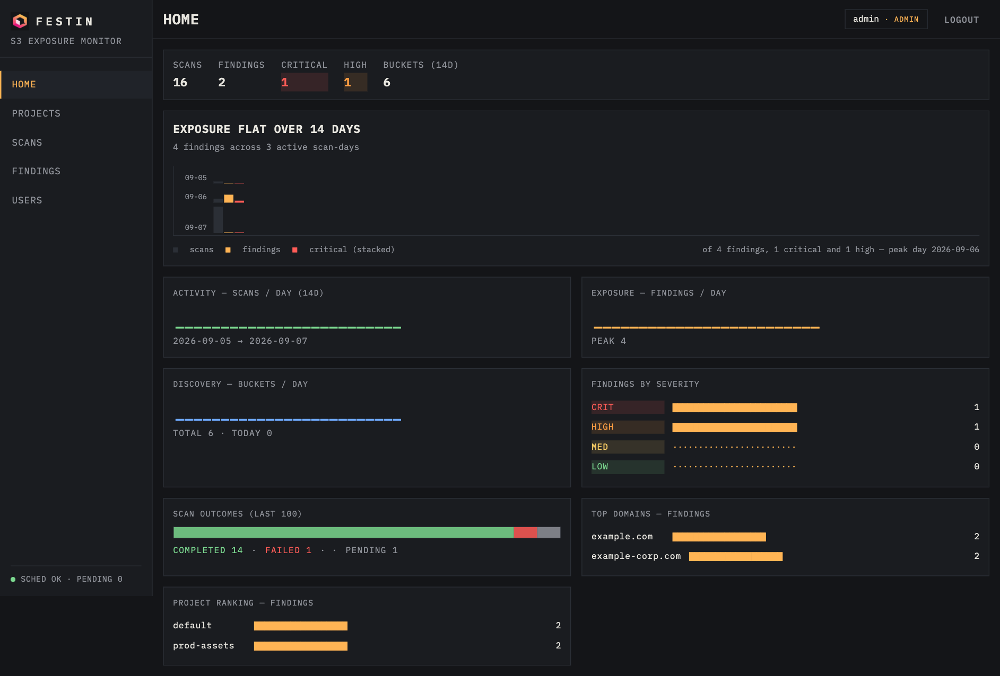
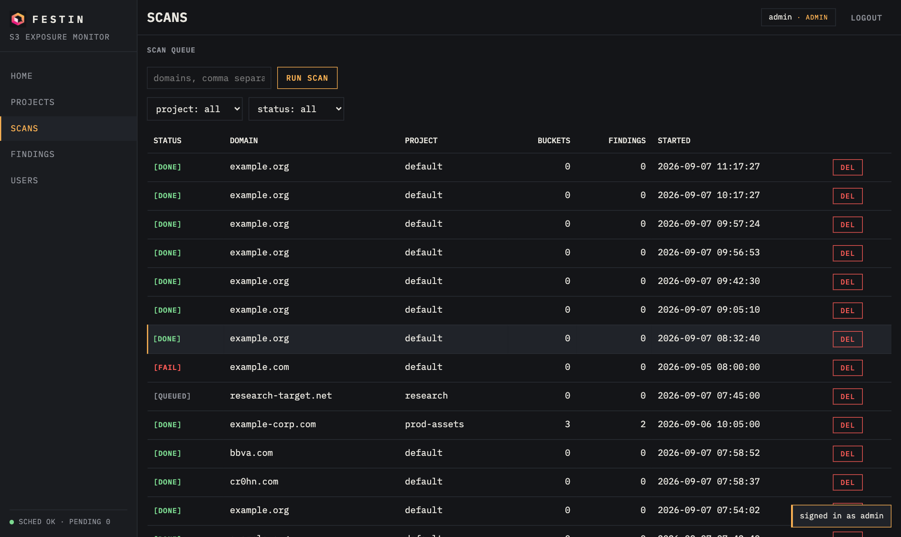
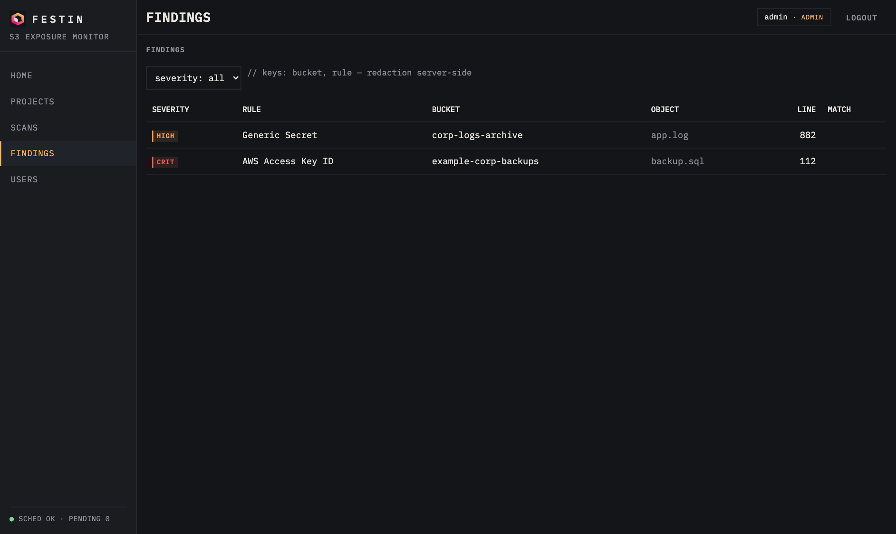
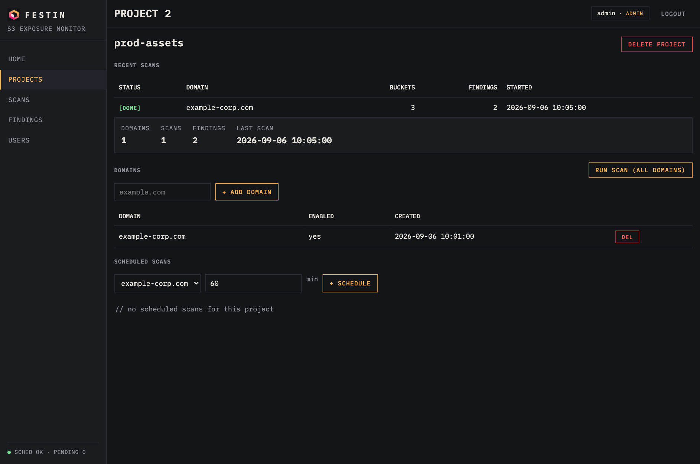
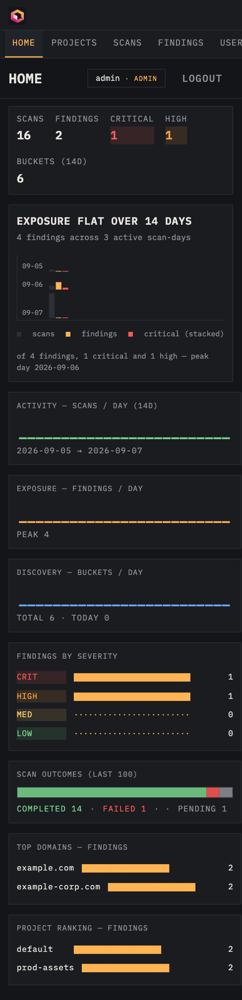

<p align="center">
  
</p>

<h1 align="center">FestIn</h1>

<p align="center">
  <strong>The powered S3 bucket finder — now with a monitoring dashboard</strong>
</p>

<p align="center">
  <a href="#development"></a>
  <a href="https://www.python.org/"></a>
  <a href="LICENSE"></a>
  <a href="https://docs.astral.sh/ruff/"></a>
  <a href="https://hub.docker.com/r/cr0hn/festin"></a>
</p>

---

**FestIn** finds **exposed S3 buckets** tied to your domains and, since the
0.3 release, ships a **multi-project, multi-user monitoring dashboard** that
watches them continuously: scheduled rescans, persisted findings, an exposure
trend chart and a REST API — in an industrial ops-console UI.

| Component | What it does |
|---|---|
| `festin scan` | Crawler + DNS discovery + bucket permutations + multi-cloud probing + secret detection. SARIF/CSV/JSONL export, Tor support, checkpoint/resume. |
| `festin serve` | Dashboard on `http://localhost:8420`: projects, scans, findings, scheduled scans, users with JWT auth. |

<p align="center">
  <a href="docs/img/dashboard-home.png"></a>
</p>

## See it in action

**HOME — the exposure radar.** Data-generated headline, severity split, scan outcomes and rankings — the full page:


**SCANS** — every execution with status tokens and project/status filters:



**FINDINGS** — secrets classified by severity, with rule, bucket, object and redacted match:



**Project detail** — domains, scheduled scans and recent executions per project:



**Responsive** — the same console on a phone:

<p align="center">
  <a href="docs/img/dashboard-mobile.png"></a>
</p>

## What's new in 0.3

- **Monitoring dashboard** (`festin-serve`): multi-project (organize domains into projects), multi-user (JWT + admin/viewer roles), scheduled scans, full REST API.
- **Scan results persisted as real rows** — buckets and findings are queryable, not just counters.
- **Exposure trend** — a data-generated headline chart: is your exposure going up or down over 14 days?
- **Ops-console UI** — vanilla-JS SPA, no build step, dark industrial design.
- **Docker image** on Docker Hub: [`cr0hn/festin`](https://hub.docker.com/r/cr0hn/festin).

Full changelog in the [documentation](#documentation).

## Quick start

```bash
# scanner: one-shot audit
uvx festin scan example.com --permute --export sarif --output findings.sarif

# dashboard: continuous monitoring
uvx festin-serve --port 8420
# open http://127.0.0.1:8420 — the first account you register becomes admin
```

Or with Docker:

```bash
docker run -d --name festin \
  -p 8420:8420 \
  -e FESTIN_JWT_SECRET="$(python3 -c 'import secrets; print(secrets.token_urlsafe(32))')" \
  -v festin-data:/data \
  cr0hn/festin:latest
```

More install options (pip, uv, dev setup) in the
[installation guide](https://cr0hn.github.io/festin/getting-started/installation/).

## Documentation

Everything lives in the MkDocs Material site — installation, tutorials,
scanner CLI reference, dashboard tour, REST API, configuration,
Docker/Kubernetes/HA deployment, security hardening and a runbook:

**[Read the documentation →](https://cr0hn.github.io/festin/)**

| Topic | Link |
|---|---|
| Tutorial: scanner | [usage/tutorial-scanner](https://cr0hn.github.io/festin/usage/tutorial-scanner/) |
| Tutorial: dashboard | [usage/dashboard-tutorial](https://cr0hn.github.io/festin/usage/dashboard-tutorial/) |
| REST API | [usage/api](https://cr0hn.github.io/festin/usage/api/) |
| Production (Docker/K8s/HA) | [deploy](https://cr0hn.github.io/festin/deploy/docker/) |
| Runbook & troubleshooting | [reference/runbook](https://cr0hn.github.io/festin/reference/runbook/) |

Build it locally:

```bash
uv sync --group docs
uv run mkdocs serve    # http://localhost:8000
```

## Development

```bash
git clone https://github.com/cr0hn/festin.git && cd festin
uv sync --group dev
timeout 130 uv run pytest --timeout=30 -q    # 305 tests — always with the timeout
```

Contribution rules, complexity gates and verification checklist:
[reference/development](https://cr0hn.github.io/festin/reference/development/).

## License

Free for personal and professional use; hosted or paid services and
commercial redistribution require a separate agreement with the author.
See [LICENSE](LICENSE).