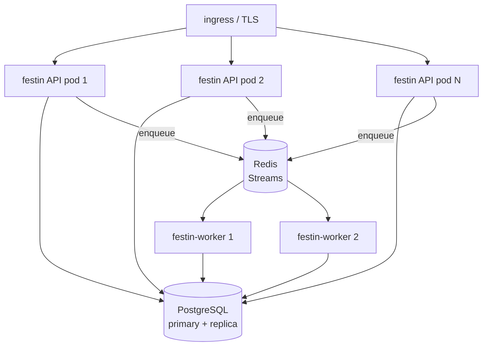

# High availability

What HA means for FestIn, what works today, and the supported paths to scale.

## Component matrix (0.4.0)

| Component | 0.4.0 state | Constraint |
|---|---|---|
| Database | SQLite (default) **or PostgreSQL** (`FESTIN_DB_DSN`) | SQLite = single writer; PG = multi-replica ready |
| Scan queue | **memory** (default) or **streaQ** (Redis Streams) via `FESTIN_QUEUE` | memory = jobs die with the pod; streaq = survive + scale |
| Scheduler | in-process loop (10 s tick) | still one instance; schedules in DB |
| Scan watchdog | marks stuck `running` scans as `failed` after `scan_timeout` | ![ok][ok] protects against dead executors |
| Auth | JWT HS256 — stateless | ![ok][ok] survives restarts, works across replicas |
| UI/API | stateless handlers | ![ok][ok] horizontally scalable |

What each mode means operationally:

- **SQLite + memory queue**: one dashboard instance, one SQLite file. Pod
  restart = in-flight scans reaped as `failed` by the watchdog; schedules
  re-fire on the first tick.
- **PostgreSQL + streaq queue**: N API replicas + N `festin-worker`
  consumers. In-flight scans survive API restarts. This is the
  production topology.

## Topology 1 — Active/passive, SQLite <span class="chip chip-ok">SIMPLEST</span>

The pragmatic small-team solution:

```
            ┌────────────┐
ingress ───▶│   proxy    │───▶ festin-0 (active)
            │ (k8s svc)  │      └── RWO volume (SQLite)
            └────────────┘
                  │ on node failure → reschedule
                  ▼
            festin pod moves to another node, remounts volume
```

- Kubernetes already gives you this: the pod reschedules, the PVC
  re-attaches, SQLite is consistent.
- Keep `replicas: 1`, `strategy: Recreate`, `readinessProbe` on
  `/api/v1/health`.
- RTO = pod reschedule time (seconds–minutes). RPO = last SQLite backup.
- Add a Litestream sidecar (S3 tail) or a CronJob backup → RPO bounded by
  backup cadence.

**Recommended** until concurrency or durability demands more.

## Topology 2 — PostgreSQL + streaQ workers <span class="chip chip-ok">PRODUCTION</span>

The full production topology, all pieces shipped in 0.4.0:



### Why this works

- **Stateless API**: JWT auth + PG-backed state → any replica serves any
  request. Scale with HPA; use `RollingUpdate`.
- **Durable queue**: `FESTIN_QUEUE=streaq` — the API only *enqueues*; a
  dead API pod loses nothing, the job sits in Redis until a worker picks
  it up.
- **Independent scanning capacity**: run 1..N `festin-worker` Deployments
  against the same Redis. Workers own their DB connections
  (`FESTIN_DB_DSN`).
- **Watchdog** (`scan_timeout`, default 600 s): a worker that dies
  mid-scan leaves the row `running`; the API scheduler loop reaps it to
  `failed` after the timeout. With workers separated, the API always
  stays alive to reap.
- **Fallback safety**: if Redis is unreachable at startup, the API falls
  back to memory mode (logs an error) — degraded but never down.

### Concrete Kubernetes pieces

=== "API Deployment (N replicas)"

    ```yaml
    apiVersion: apps/v1
    kind: Deployment
    metadata:
      name: festin-api
    spec:
      replicas: 2                      # safe with PG: no shared volume
      strategy: {type: RollingUpdate}  # no volume overlap anymore
      template:
        spec:
          containers:
            - name: festin
              image: cr0hn/festin:latest
              args: ["serve", "--host", "0.0.0.0"]
              env:
                - name: FESTIN_DB_DSN
                  valueFrom:
                    secretKeyRef: {name: festin-secrets, key: db-dsn}
                - name: FESTIN_JWT_SECRET
                  valueFrom:
                    secretKeyRef: {name: festin-secrets, key: jwt-secret}
                - name: FESTIN_QUEUE
                  value: streaq
                - name: FESTIN_REDIS_URL
                  value: redis://redis:6379/0
                - name: FESTIN_RATE_LIMIT_ATTEMPTS
                  value: "5"
    ```

=== "Worker Deployment (scale scans)"

    ```yaml
    apiVersion: apps/v1
    kind: Deployment
    metadata:
      name: festin-worker
    spec:
      replicas: 2                      # scan throughput knob
      template:
        spec:
          containers:
            - name: worker
              image: cr0hn/festin:0.4.0
              command: ["festin-worker"]
              env:
                - name: FESTIN_DB_DSN
                  valueFrom:
                    secretKeyRef: {name: festin-secrets, key: db-dsn}
                - name: FESTIN_REDIS_URL
                  value: redis://redis:6379/0
          # no web port: workers only consume
    ```

=== "PostgreSQL (CloudNativePG or managed)"

    ```yaml
    # Recommended: CloudNativePG operator
    apiVersion: postgresql.cnpg.io/v1
    kind: Cluster
    metadata:
      name: festin-pg
    spec:
      instances: 2          # primary + replica
      storage: {size: 10Gi}
      # DSN for the app: postgres://festin:<pass>@festin-pg-rw:5432/festin
    ```

    Or use your cloud's managed Postgres — set `FESTIN_DB_DSN` to its DSN
    and you're done.

## Topology 3 — Read replicas with SQLite <span class="chip chip-warn">NICHE</span>

Only if you stay on SQLite AND read traffic is high:

- N replicas serve UI + reads from a read-only SQLite copy (Litestream
  tail or WAL streaming).
- One active instance owns mutations + scheduler.
- Proxy routes `POST/DELETE/PATCH` to the active; `GET` anywhere.
- Requires the small scheduler-disable patch. Use Topology 2 instead —
  less moving parts for the same result.

## Anti-patterns (do not do)

| Anti-pattern | Why it breaks |
|---|---|
| `replicas: 2` with the same RWO SQLite volume | second pod can't mount the volume / corrupts on RWX |
| Rolling update on a SQLite deployment | old+new pod overlap on one file — use `Recreate` |
| Two schedulers on one schedule table | double scans (no distributed lock) — scheduler runs only with SQLite topology |
| Backing up with `cp` on a live DB | mid-write corruption; use `.backup` / PG dumps |
| `FESTIN_QUEUE=streaq` with zero `festin-worker` processes | jobs pile up in Redis forever (they don't run) |

## Decision matrix

| Need | Choose |
|---|---|
| "Single server, occasional reboots" | Topology 1 (SQLite) — simplest |
| "True HA, N API replicas, durable scans" | Topology 2 (PostgreSQL + streaQ) — shipped in 0.4.0 |
| "Heavy scanning, light UI" | Topology 2 + more worker replicas |
| "Must stay on SQLite" | Topology 1, accept single-writer |

## Operational checklist (production)

- [ ] `FESTIN_JWT_SECRET` random, from a secret store
- [ ] `FESTIN_DB_DSN` set (Postgres) **and** PG backups automated
- [ ] `FESTIN_QUEUE=streaq` + ≥1 `festin-worker` running + Redis monitored
- [ ] `/api/v1/health` wired to uptime monitoring on every API replica
- [ ] Worker crash = jobs stay queued → alert on queue depth (Redis
      `XLEN` on the streaq stream), not just pod status
- [ ] `scan_timeout` tuned: > your longest expected scan
- [ ] Rate limits tuned (`FESTIN_RATE_LIMIT_*`) — plus proxy-level limiting

[ok]: https://img.shields.io/badge/-ok-7bd88f "ok"