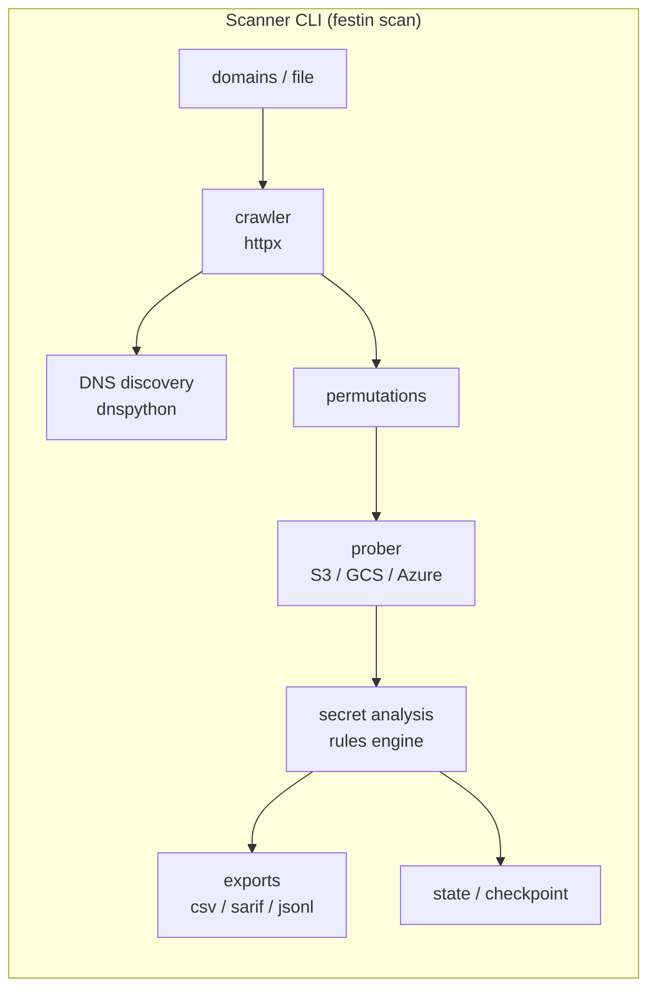
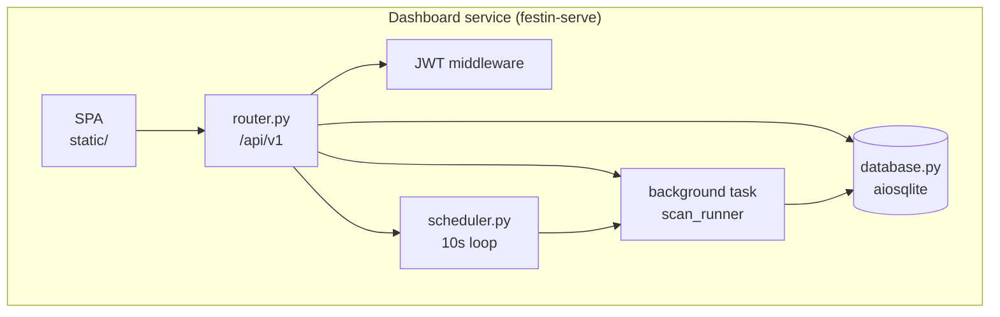
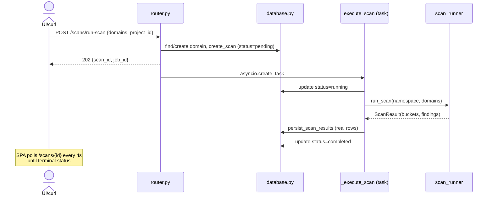
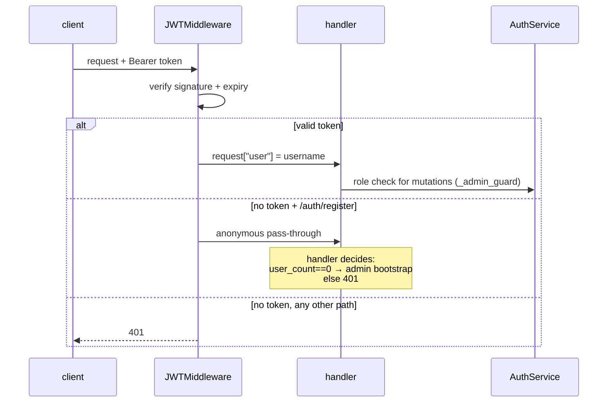
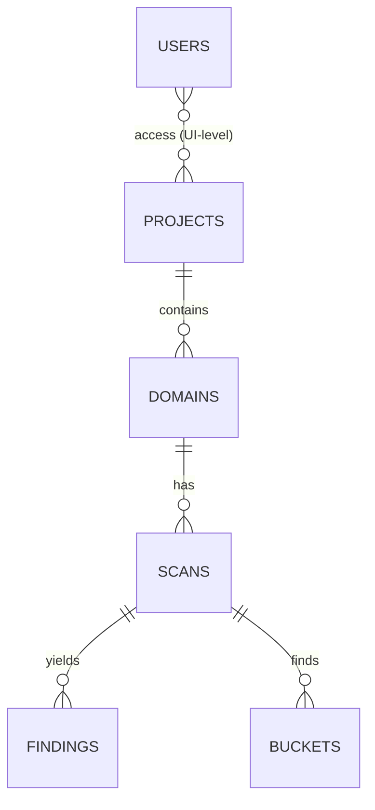

# Architecture

How FestIn is built, in one pass.

## Two systems, one package





## Package layout

```
festin/
├── cli.py               typer CLI: scan / serve / version
├── scan_runner.py       scan pipeline (also called by the service)
├── s3.py                bucket probing across cloud providers
├── secrets.py           secret-detection rules
├── permutations.py      bucket-name permutation engine
├── analysis.py          object content analysis
├── exports.py           csv / sarif / jsonl writers
├── checkpoint.py        resume support
├── state.py             state files (enables diffing)
├── ratelimit.py         probe rate control
├── models.py            shared dataclasses (ScanResult, Finding, S3Bucket)
│
└── service/
    ├── serve.py         app factory, middleware wiring, entrypoint
    ├── router.py        all REST endpoints (FestinRouter)
    ├── auth.py          bcrypt + JWT + middleware
    ├── database.py      aiosqlite layer (schema + CRUD)
    ├── scheduler.py     periodic scan loop + orchestration
    ├── queues.py        in-memory queue (Redis path unwired)
    └── static/          the SPA (vanilla JS, hash routing)
```

!!! warning "Two HTTP servers live in the repo"
    `festin/api.py` is a legacy read-only state-file server.
    The real dashboard is `festin/service/serve.py`. Don't confuse them.

## Request lifecycle (scan trigger)



## Authentication flow



The invariant: **the middleware identifies, the handler authorizes.**
`/auth/register` is never exempted from the middleware — exempting it made
valid admins look anonymous (a real bug; see [ADR #4](design-decisions.md)).

## Data model



| Table | Key columns |
|---|---|
| `projects` | id, name (unique), description |
| `domains` | id, domain_name, project_id, enabled |
| `scans` | id, domain_id, project_id, status, buckets_found, findings_count, started_at, finished_at |
| `findings` | id, scan_id, bucket, object, rule, severity, line, match (redacted) |
| `buckets` | id, scan_id, name, objects_count |
| `scheduled_scans` | id, domain, interval_minutes |
| `users` | id, username, password_hash (bcrypt), role |

Migrations are idempotent: `CREATE TABLE IF NOT EXISTS` + guarded `ALTER TABLE` inside `Database.migrate()` (executescript).

## Scaling story

The deliberate seams for growth (all inside `festin/service/`):

1. **Database** — swap `Database` internals for asyncpg/Postgres. Callers never touch raw connections.
2. **Scan execution** — replace the in-process `asyncio.create_task` in `run-scan` with a queue consumer; `queues.py` already sketches the Redis path.
3. **Scheduler** — extract to its own deployment; it only needs the DB.

See [HA patterns](../deploy/ha.md) for how these compose.