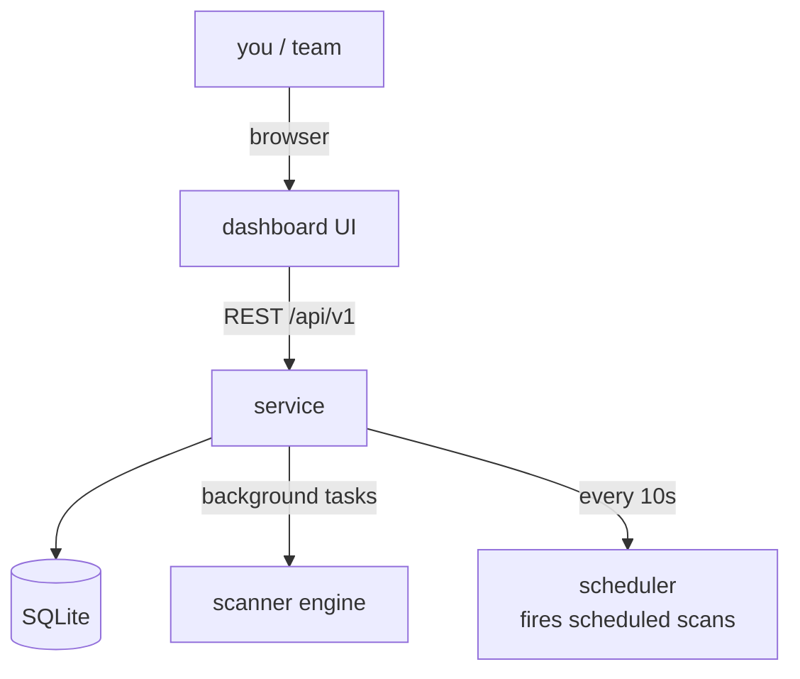

# Tutorial — Dashboard: from zero to continuous monitoring

The long-form guide to the monitoring service. By the end you'll have a
multi-user, multi-project exposure radar running on your own machine.

---

## The mental model

The dashboard wraps the scanner in a **service**:



You register **projects**, fill them with **domains**, and the service runs
scans — manually or on a schedule — persisting every **bucket** and
**finding** to the database. The UI reads from that database.


## Step 0 — Start and bootstrap

```bash
uv run python -m festin.service.serve --port 8420
```

Open `http://127.0.0.1:8420`. On an empty database the login screen offers
**CREATE ADMIN ACCOUNT** — the first registered user *is* the admin:

1. Click **CREATE ADMIN ACCOUNT**.
2. Pick username + password → you're in as `admin`.

!!! note "Why the first user is special"
    With an empty users table, registration is open exactly once (bootstrap).
    After that, only an admin token can create more users. See the
    [auth matrix](../usage/api.md#authregister-semi-public).

## Step 1 — Create your first project

Projects are the organizing unit — a client, a product, a bug-bounty scope.

1. Go to **PROJECTS**.
2. In the `+ NEW PROJECT` form: name it `prod-assets`, description
   *"public origins of prod"*.
3. Click the row to open the project.

The project page shows counters (domains, scans, findings, last scan) that
update as work happens.

## Step 2 — Add domains

Inside the project, **+ ADD DOMAIN**:

```
example.com
```

Add as many as you need. Each domain row can be deleted with the two-step
`DEL` button (first click arms it → `confirm?` → click again within 3 s).

## Step 3 — Run your first scan

**RUN SCAN (ALL DOMAINS)** queues a scan for every domain in the project.

- The scan row appears in **RECENT SCANS** as `[QUEUED]`.
- Within seconds it flips to `[RUNNING]`.
- On completion: `[DONE]` (or `[FAIL]` — the server log tells you why).

!!! tip "What happens under the hood"
    The service stores the scan record immediately, runs the scanner engine
    as an asyncio background task, and persists every bucket and finding as
    real database rows. The UI polls the scan until it reaches a terminal
    state.

## Step 4 — Read the results

Click any scan row:

- **Buckets** — name + object count. This is your exposed surface.
- **Findings** — one row per secret: severity (`CRIT`/`HIGH`/`MED`/`LOW`),
  detection rule, bucket, object, line, and a **redacted** match
  (`AKIA****EXAMPLE` — the API never returns full secrets).

## Step 5 — Schedule continuous monitoring

Manual scans are so 2019. In the project page, **SCHEDULED SCANS**:

1. Pick a domain from the dropdown.
2. Set the interval in minutes (e.g. `60` = hourly).
3. **+ SCHEDULE**.

The scheduler loop ticks every **10 seconds** inside the service; when a
schedule is due, a scan fires automatically and its results show up like any
other scan.

!!! warning "Restart behavior"
    The `last-run` tracker is in-memory. After a service restart, **every
    schedule fires once** on the first tick. Plan restarts with that in mind
    (or accept the extra scan).

## Step 6 — The HOME dashboard

After a few scans, the home view starts telling a story:

- **Counter strip** — totals at a glance: scans, findings, critical, high,
  buckets discovered in the last 14 days.
- **EXPOSURE TREND (hero)** — the headline chart. The title is *generated
  from your data*: `EXPOSURE TRENDING DOWN 40% SINCE 09-05`, `FLAT`, `UP`…
  Below it, one group of bars per day: scans (grey), findings (amber),
  critical stacked in red.
- **Activity / Exposure / Discovery** — 14-day sparklines.
- **Findings by severity**, **Scan outcomes** (last 100), **Top domains**,
  **Project ranking**.

Refresh happens automatically (15 s polling on list views; 4 s on a scan
detail while it's still running).

## Step 7 — Invite the team (users & roles)

Log in as admin → **USERS**:

- **+ CREATE USER** — username, password, role (`viewer` or `admin`).
- Flip a role with the inline select (instant `PATCH`).
- `DEL` removes a user — never yourself, never the last admin (the UI knows,
  and so does the API).

What each role can do:

| Capability | Viewer | Admin |
|---|:-:|:-:|
| Browse projects/scans/findings | ![y][y] | ![y][y] |
| Trigger scans | ![y][y] | ![y][y] |
| Manage projects/domains/schedules | ![n][n] | ![y][y] |
| Manage users | ![n][n] | ![y][y] |


## Step 8 — Organize by project

Real setups have more than one client or environment. Create them:

- `prod-assets` — the public origins.
- `research` — bug-bounty targets.
- `client-acme` — contract work (findings are compartmentalized per project).

The **SCANS** view filters by project and status; **FINDINGS** filters by
severity across everything. **HOME** ranks projects and domains by findings
so the loudest problem surfaces first.

## Step 9 — Wire it into your tooling

Everything the UI does is a REST call — automate it:

=== "Trigger a scan"

    ```bash
    TOKEN=$(curl -s -X POST localhost:8420/api/v1/auth/login \
      -H 'Content-Type: application/json' \
      -d '{"username":"admin","password":"..."}' | jq -r .access_token)

    curl -s -X POST localhost:8420/api/v1/scans/run-scan \
      -H "Authorization: Bearer $TOKEN" \
      -H 'Content-Type: application/json' \
      -d '{"domains": ["example.com"], "project_id": 2}'
    ```

=== "Pull criticals"

    ```bash
    curl -s "localhost:8420/api/v1/findings?severity=critical" \
      -H "Authorization: Bearer $TOKEN" | jq .
    ```

=== "Export for CI"

    ```bash
    curl -s "localhost:8420/api/v1/scans/14" \
      -H "Authorization: Bearer $TOKEN" \
      | jq -r '.findings[] | [.severity, .rule, .bucket] | @tsv'
    ```

Full reference: [REST API](../usage/api.md).

## Step 10 — Daily operation

- **Check the pulse**: the sidebar footer shows `● SCHED OK · PENDING N` —
  amber dot when work is queued, red on errors.
- **Backups**: SQLite file → [`sqlite3 .backup`](../reference/runbook.md#backup-restore) while running.
- **Upgrades**: stop, swap, start — migrations are idempotent.
- **Token expiry**: 60 minutes. When the UI says *Session expired*, log in
  again — that's by design (no refresh tokens).

---

## Cheat sheet

| Task | Where |
|---|---|
| Create project | PROJECTS → `+ NEW PROJECT` |
| Add domains | project page → `+ ADD DOMAIN` |
| Scan everything in a project | project page → `RUN SCAN (ALL DOMAINS)` |
| Hourly rescans | project page → `+ SCHEDULE` |
| Find the worst offender | HOME → Project ranking |
| Investigate a leak | SCANS → scan row → findings table |
| Invite a teammate | USERS → `+ CREATE USER` (admin) |

When you're ready to make it someone else's problem too:
[deploy it](../deploy/docker.md).

[y]: https://img.shields.io/badge/-yes-7bd88f "yes"
[n]: https://img.shields.io/badge/-no-8f9299 "no"