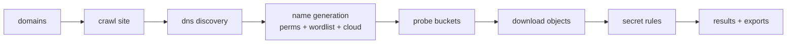

# Tutorial — Scanner: your first exposure audit

This is the long-form user guide. It walks the scanner end to end, the way
[FastAPI's tutorial](https://fastapi.tiangolo.com/tutorial/) does: one concept
at a time, every step runnable.

---

## The mental model

FestIn answers one question: **"which S3 buckets related to this domain are
exposed, and what's inside them?"**



You give it domains. It gives you **buckets** (with object counts) and
**findings** (secrets, classified by severity).

## Step 1 — The simplest scan

```bash
uvx festin scan example.com
```

What happens:

1. **Crawl** — FestIn fetches `example.com` and follows links (3 levels deep
   by default) looking for infrastructure hints.
2. **DNS discovery** — it resolves CNAMEs; `files.example.com →
   example.s3.amazonaws.com` is a classic exposed-bucket smell.
3. **Name generation** — from every domain it derives candidate bucket names.
4. **Probing** — each candidate is checked against AWS, GCP and Azure
   endpoints.
5. **Analysis** — objects in open buckets are downloaded and matched against
   the secret rules (AWS keys, private keys, tokens, passwords…).

Console output shows buckets as they're found:

```
[+] Bucket found: example.com-backups (AWS, 412 objects)
[+] Bucket found: example-static-assets (AWS, 58 objects)
[!] SECRET  AWS Access Key ID  example.com-backups/backup.sql:112
```

## Step 2 — Control the crawl

Real domains crawl wide. Keep it on-scope:

```bash
# only follow links inside example.com (or subdomains)
uvx festin scan example.com --domain-regex '.*\.example\.com'

# don't follow links at all: pure DNS + name probing, very fast
uvx festin scan example.com --no-links

# stricter timeouts for slow-but-polite runs
uvx festin scan example.com --http-timeout 2 --concurrency 3
```

| You want | Flags |
|---|---|
| Speed | `--no-links`, `--profile fast`, `--concurrency 10` |
| Depth | `--http-max-recursion 5`, `--permute --cloud` |
| Politeness | `--profile stealth`, `--http-timeout 5` |
| Scope safety | `--domain-regex`, `--domain-black-list`, `--domain-white-list` |

## Step 3 — Expand the search: permutations

`example.com` alone maps to few bucket names. Permutations multiply it:

```bash
uvx festin scan example.com --permute
```

This probes `example-com`, `com-example`, `example-backup`, `example-files`,
`backup-example`, … hundreds of candidates. Feed your own vocabulary:

```bash
echo -e "backup\nstatic\nmedia\ndev\nstaging" > words.txt
uvx festin scan example.com --permute --wordlist words.txt
```

## Step 4 — Multi-cloud

AWS is not the only player. `--cloud` probes the plain domain-derived names
across **all supported providers**:

```bash
uvx festin scan example.com --cloud
```

Combine with permutations for maximum coverage:

```bash
uvx festin scan example.com --permute --cloud
```

## Step 5 — Reports

FestIn speaks three export languages:

=== "SARIF — CI / GitHub code scanning"

    ```bash
    uvx festin scan example.com --export sarif --output findings.sarif
    ```

    Drop it into GitHub's code-scanning upload step and exposure findings
    appear as alerts.

=== "CSV — spreadsheets & tickets"

    ```bash
    uvx festin scan example.com --export csv --output findings.csv
    ```

=== "JSONL — log pipelines"

    ```bash
    uvx festin scan example.com --export jsonl --output findings.jsonl
    # one JSON object per line: jq-friendly
    jq 'select(.severity == "critical")' findings.jsonl
    ```

Plus a **streaming bucket log** (one JSON per discovered bucket, written as
buckets are found — useful for very long scans):

```bash
uvx festin scan -f targets.txt --result-file buckets.jsonl --quiet
```

## Step 6 — Long scans: checkpoint and resume

A 50k-domain sweep can die. Make it resumable:

```bash
uvx festin scan -f big-list.txt --checkpoint scan.ckpt

# interrupted? (Ctrl-C, crash, laptop sleep)
uvx festin scan --resume --checkpoint scan.ckpt
```

Progress is persisted to `scan.ckpt`; `--resume` continues where it stopped.

## Step 7 — Continuous recon with watch mode

```bash
uvx festin scan -f targets.txt --watch --checkpoint recon.ckpt --quiet
```

The process stays alive; **append domains to `targets.txt` at any time** and
they're scanned automatically. This is the pattern for bug-bounty pipelines.

## Step 8 — Go dark with Tor

```bash
# tor running locally with SOCKS5 on 9050 (default config in most distros)
uvx festin scan sensitive-target.com --tor --profile stealth
```

All probe traffic goes through Tor. `--profile stealth` also slows the probe
rate so you blend in.

!!! warning "Authorization"
    Only scan assets you own or are authorized to test. Anonymized probing
    doesn't make unauthorized scanning legal — see [security](../deploy/security.md).

## Step 9 — Diffing with state files

```bash
# today
uvx festin scan example.com --state today.json --quiet

# next week: what changed?
uvx festin scan example.com --state next-week.json --quiet
festin diff today.json next-week.json    # new / disappeared buckets
```

`--state` persists the full `ScanResult`; the diff tells you which buckets
appeared or disappeared between runs.

## Step 10 — Put it together: a weekly audit pipeline

```bash
#!/usr/bin/env bash
set -euo pipefail

# 1. scan with every discovery technique
uvx festin scan -f targets.txt \
  --permute --cloud \
  --checkpoint weekly.ckpt \
  --result-file buckets.jsonl \
  --export sarif --output weekly.sarif \
  --quiet

# 2. upload SARIF to GitHub code scanning
gh api repos/MYORG/MYREPO/code-scanning/sarifs -F sarif=@weekly.sarif

# 3. alert on criticals
jq 'select(.severity == "critical")' buckets.jsonl \
  | slack-notify "#security"
```

---

## Checklist — pick your flags

| Goal | Command sketch |
|---|---|
| Quick check | `festin scan example.com` |
| Full audit | `... --permute --cloud --http-max-recursion 5` |
| CI gate | `... --quiet --no-print --export sarif --output x.sarif` |
| Bug bounty | `... -f targets.txt --watch --checkpoint r.ckpt` |
| Stealth | `... --tor --profile stealth --quiet` |
| DNS only | `... --no-links --dns-resolver 8.8.8.8,9.9.9.9` |

Next: [the dashboard tutorial](dashboard-tutorial.md) — turn one-shot scans
into continuous monitoring.